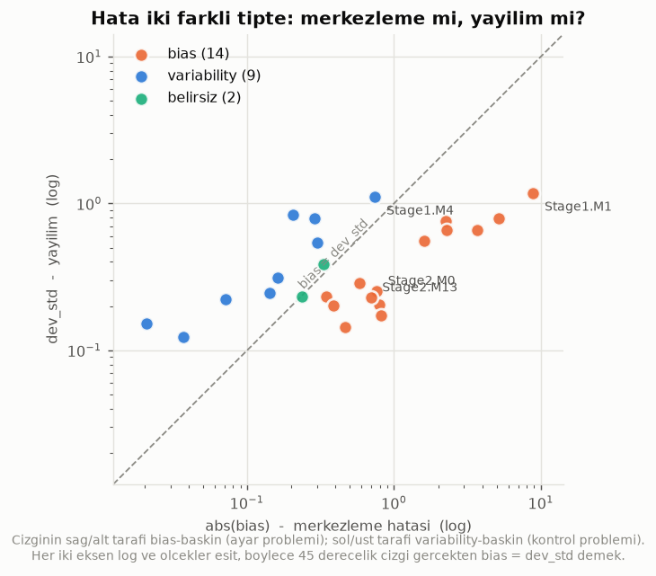
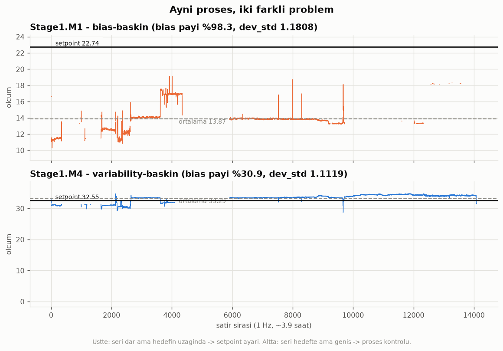

# Faz 1 - Cleaning Report

Kaynak: `data/raw/continuous_factory_process.csv`  
Uretildi: `python src/data_processing/clean.py`

## Uygulanan kurallar

| # | Kural |
|---|---|
| R1 | Output Actual'lardaki tam 0 -> NaN (K2/A2: sensor dropout, olcum degil) |
| R2 | Output Actual'lardaki negatif degerler -> NaN (K2/O3: boyut negatif olamaz) |
| R3 | Birebir ozdes kolon dusuruldu (K8: yapay multicollinearity) |
| R4 | Duplicate timestamp'ler isaretlendi, satir silinmedi (veri kaybi olmasin) |
| R5 | Stage1 setpoint == 0 olan satirlar durus blogu olarak isaretlendi (K3) |
| R6 | Gecerli veri orani < %50 olan output'lar 'kapsam disi' isaretlendi (A3) |
| R7 | abs(setpoint) < dev_std olan output'lar 'setpoint anlamsiz' olarak kapsam disi birakildi -- oransal KPI'lari tanimsiz (A8) |
| R8 | setpoint'in %1'inden kucuk (ama sifir olmayan) olcumler -> NaN. Float underflow artifakti; sadece '== 0' testi bunlari kaciriyordu. |

## Etki

- Girdi: **14,088 x 116**
- Cikti: **14,088 x 118** (3 flag + 1 seq kolonu eklendi)
- **R3** dusurulen kolon: ['Machine4.Temperature4.C.Actual']
- **R1** NaN'a cevrilen sifir: **78,539** hucre
- **R2** NaN'a cevrilen negatif: **126** hucre
- **R8** NaN'a cevrilen imkansiz-kucuk deger: **185** hucre
- **R4** duplicate timestamp'li satir: 27 (silinmedi, isaretlendi)
   *Not:* audit raporu 14 diyor cunku `duplicated()` her tekrarin ilk
  gorunumunu saymaz. Burada `keep=False` ile cakismanin **her iki tarafi**
  isaretleniyor; ayni olayin iki farkli sayimi.
- **R5** durus blogu satiri: 56 (silinmedi, isaretlendi)

Output olcum hucrelerinin **%18.7**'i NaN'a cevrildi (78,850 / 422,640). Hicbir satir silinmedi.

### Neden hicbir satir silinmedi?

Sifirlar tek bir durus blogunda toplanmis olsa satir bazli filtreleme
dogru olurdu. Ama audit gosterdi ki sifirlar yuzlerce kisa kesinti halinde
dagilmis (Stage1.M14 -> 673 ayri kesinti) ve her output'ta FARKLI
satirlarda. Satir silmek, bir output'un dropout'u yuzunden diger 25
output'un gecerli olcumunu de atmak demekti. Bunun yerine hucre bazli
NaN kullanildi; her output kendi gecerli verisiyle analiz edilir.

## Output KPI ozeti

`bias` = ortalama isaretli sapma (merkezleme hatasi).  
`dev_std` = sapmanin standart sapmasi (kararlilik).  
`bias_share_pct` = toplam hatanin (RMSE^2) yuzde kaci bias'tan geliyor.

Bu ayrim K6 geregi: **bias bir ayar problemi, variability bir kontrol
problemidir.** Ikisi farkli aksiyon gerektirir.

| output | setpoint | valid_pct | sp_over_std | bias | bias_pct | dev_std | mae | rmse | bias_share_pct | error_type | in_scope |
|---|---|---|---|---|---|---|---|---|---|---|---|
| Stage1.M0 | 13.75 | 99.5 | 66.82 | -0.7887 | -5.74 | 0.2058 | 0.7963 | 0.8151 | 93.6 | bias | evet |
| Stage1.M1 | 22.74 | 58.0 | 19.26 | -8.8695 | -39.0 | 1.1808 | 8.8695 | 8.9478 | 98.3 | bias | evet |
| Stage1.M2 | 13.02 | 99.4 | 23.45 | -1.5927 | -12.23 | 0.5552 | 1.6504 | 1.6867 | 89.2 | bias | evet |
| Stage1.M3 | 21.88 | 99.0 | 94.22 | -0.3477 | -1.59 | 0.2322 | 0.3554 | 0.4181 | 69.2 | bias | evet |
| Stage1.M4 | 32.55 | 98.8 | 29.28 | 0.7435 | 2.28 | 1.1119 | 1.1695 | 1.3375 | 30.9 | variability | evet |
| Stage1.M5 | 2.74 | 4.6 | 7.41 | -0.053 | -1.94 | 0.37 | 0.1637 | 0.3735 | 2.0 | - | HAYIR |
| Stage1.M6 | 4.25 | 66.5 | 5.57 | -2.2385 | -52.67 | 0.7636 | 2.2803 | 2.3651 | 89.6 | bias | evet |
| Stage1.M7 | 2.97 | 37.8 | 31.81 | -0.0561 | -1.89 | 0.0934 | 0.0626 | 0.1089 | 26.5 | - | HAYIR |
| Stage1.M8 | 21.3 | 94.5 | 105.96 | -0.3882 | -1.82 | 0.201 | 0.3886 | 0.4371 | 78.9 | bias | evet |
| Stage1.M9 | 19.52 | 94.8 | 67.81 | -0.5779 | -2.96 | 0.2879 | 0.5804 | 0.6456 | 80.1 | bias | evet |
| Stage1.M10 | 8.65 | 98.1 | 49.88 | -0.8186 | -9.46 | 0.1734 | 0.8221 | 0.8368 | 95.7 | bias | evet |
| Stage1.M11 | 6.16 | 25.7 | 32.01 | -0.3426 | -5.56 | 0.1925 | 0.3506 | 0.393 | 76.0 | - | HAYIR |
| Stage1.M12 | 2.02 | 77.3 | 14.1 | -0.4642 | -22.98 | 0.1433 | 0.4654 | 0.4858 | 91.3 | bias | evet |
| Stage1.M13 | 3.16 | 97.6 | 3.79 | -0.2064 | -6.53 | 0.8328 | 0.3922 | 0.8579 | 5.8 | variability | evet |
| Stage1.M14 | 17.72 | 64.4 | 26.73 | -2.2787 | -12.86 | 0.663 | 2.2875 | 2.3732 | 92.2 | bias | evet |
| Stage2.M0 | 12.05 | 91.3 | 47.75 | 0.7608 | 6.31 | 0.2523 | 0.7772 | 0.8016 | 90.1 | bias | evet |
| Stage2.M1 | 11.71 | 95.2 | 14.82 | -5.1309 | -43.82 | 0.79 | 5.1315 | 5.1914 | 97.7 | bias | evet |
| Stage2.M2 | 11.0 | 95.7 | 13.87 | -0.2871 | -2.61 | 0.7931 | 0.3391 | 0.8434 | 11.6 | variability | evet |
| Stage2.M3 | 20.73 | 94.5 | 38.45 | -0.3009 | -1.45 | 0.5392 | 0.3988 | 0.6174 | 23.7 | variability | evet |
| Stage2.M4 | 31.36 | 9.3 | 22.99 | 0.2065 | 0.66 | 1.3642 | 1.1918 | 1.3792 | 2.2 | - | HAYIR |
| Stage2.M5 | 2.71 | 98.6 | 12.14 | 0.0711 | 2.62 | 0.2233 | 0.1477 | 0.2344 | 9.2 | variability | evet |
| Stage2.M6 | 0.01 | 98.6 | 0.05 | 0.5296 |  | 0.1964 | 0.5296 | 0.5648 | 87.9 | - | HAYIR |
| Stage2.M7 | 2.75 | 97.5 | 11.83 | 0.237 | 8.62 | 0.2325 | 0.2628 | 0.332 | 51.0 | belirsiz | evet |
| Stage2.M8 | 19.39 | 93.1 | 50.0 | 0.3318 | 1.71 | 0.3878 | 0.4108 | 0.5104 | 42.3 | belirsiz | evet |
| Stage2.M9 | 16.47 | 70.1 | 66.88 | 0.1429 | 0.87 | 0.2462 | 0.1856 | 0.2847 | 25.2 | variability | evet |
| Stage2.M10 | 7.93 | 95.5 | 64.22 | -0.0366 | -0.46 | 0.1235 | 0.0728 | 0.1288 | 8.1 | variability | evet |
| Stage2.M11 | 5.65 | 95.5 | 37.13 | 0.0205 | 0.36 | 0.1522 | 0.1181 | 0.1536 | 1.8 | variability | evet |
| Stage2.M12 | 1.85 | 98.1 | 5.91 | 0.161 | 8.7 | 0.313 | 0.2536 | 0.352 | 20.9 | variability | evet |
| Stage2.M13 | 2.89 | 98.6 | 12.71 | 0.6951 | 24.05 | 0.2275 | 0.7005 | 0.7314 | 90.3 | bias | evet |
| Stage2.M14 | 11.71 | 93.5 | 17.88 | -3.6709 | -31.35 | 0.655 | 3.6753 | 3.7289 | 96.9 | bias | evet |

## Kapsam

30 output'un **25**'i analize giriyor. Kapsam disi kalanlar, hangi gerekceyle cikarildiklariyla birlikte:

| output | gerekce |
|---|---|
| `Stage1.M5` | kapsam disi: gecerli veri %4.6 < %50 (R6) |
| `Stage1.M7` | kapsam disi: gecerli veri %37.8 < %50 (R6) |
| `Stage1.M11` | kapsam disi: gecerli veri %25.7 < %50 (R6) |
| `Stage2.M4` | kapsam disi: gecerli veri %9.3 < %50 (R6) |
| `Stage2.M6` | kapsam disi: setpoint anlamsiz, abs(sp)/std=0.05 < 1.0 (R7) |

> **R7 neden gerekti:** `Stage2.M6`'nin setpoint'i 0.01, sapmasinin standart
> sapmasi 0.197. Hedef, olcum gurultusunun yirmide biri kadar -- yani gercek
> bir hedef degil, girilmemis/kullanilmayan bir alan. Ona bolununce bias
> **%5295** cikiyordu ve output yanlislikla 'bias-baskin' siniflaniyordu.
> Esik veriden dogruluyor: M6'nin abs(sp)/std orani 0.05, bir sonraki output
> 3.79 -- arada buyuk bosluk var, kesim keyfi degil.

## Bulgular

> **Bias-baskin (14 adet)** - hatanin >%60'i merkezleme
> kaymasindan. Bir **ayar/kalibrasyon** problemi; proses kararli ama yanlis
> noktada calisiyor:
>   - `Stage1.M1`: bias -8.870 (-39.0%), hatanin %98.3'i bias
>   - `Stage2.M1`: bias -5.131 (-43.8%), hatanin %97.7'i bias
>   - `Stage2.M14`: bias -3.671 (-31.4%), hatanin %96.9'i bias
>   - `Stage1.M10`: bias -0.819 (-9.5%), hatanin %95.7'i bias
>   - `Stage1.M0`: bias -0.789 (-5.7%), hatanin %93.6'i bias
>   - `Stage1.M14`: bias -2.279 (-12.9%), hatanin %92.2'i bias
>
> **Variability-baskin (9 adet)** - hatanin <%40'i bias.
> Bir **proses kontrol** problemi; optimizasyonun asil hedefi:
>   - `Stage1.M4`: dev_std 1.112, hatanin sadece %30.9'i bias
>   - `Stage1.M13`: dev_std 0.833, hatanin sadece %5.8'i bias
>   - `Stage2.M2`: dev_std 0.793, hatanin sadece %11.6'i bias
>   - `Stage2.M3`: dev_std 0.539, hatanin sadece %23.7'i bias
>   - `Stage2.M12`: dev_std 0.313, hatanin sadece %20.9'i bias
>   - `Stage2.M9`: dev_std 0.246, hatanin sadece %25.2'i bias
>
> **Belirsiz (2 adet)** - `bias_share_pct` %40-%60
> bandinda. Bias ve variability bilesenleri neredeyse esit; tek bir esige
> dayanarak kategoriye zorlanmadi:
>   - `Stage2.M7`: bias 0.2370 ~ dev_std 0.2325 (bias payi %51.0)
>   - `Stage2.M8`: bias 0.3318 ~ dev_std 0.3878 (bias payi %42.3)

> **Neden onemli:** Bias-baskin bir output'u optimizasyonla kovalamak
> yanlistir - cozumu setpoint'i duzeltmektir, proses parametresi oynatmak
> degil. Optimizasyon variability-baskin output'lara odaklanir. Belirsiz
> olanlar Faz 2'de control chart'la incelenip karara baglanir.
