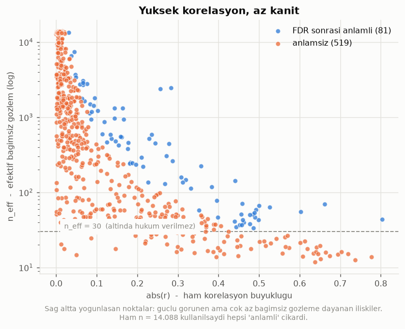

# Faz 2 - Otokorelasyon Duzeltmeli Korelasyon Analizi

Kaynak: `data/processed/clean_v1.csv`  
Uretildi: `python src/analysis/correlation.py`

25 output deviation x 24 karar degiskeni = **600 cift** incelendi.

## Yontem: neden efektif ornek buyuklugu

14.088 gozlemle siradan bir anlamlilik testi yapilirsa `r = 0.02` bile
`p < 0.05` verir. Ama ardisik gozlemler bagimsiz degil (K5: lag-1
otokorelasyon 0.93-0.99). Bartlett'in **tam** duzeltmesi:

```
n_eff = n / (1 + 2 * sum_k (1 - k/n) * rho_x(k) * rho_y(k))
```
Yalnizca lag-1 kullanan basitlestirilmis surum AR(1) varsayar. Bu veride
seriler cok daha uzun hafizali (`Machine1.MotorRPM` lag-600'de hala 0.94),
dolayisiyla lag-1 surumu otokorelasyonu ciddi sekilde eksik duzeltirdi --
denendi ve medyan n_eff'i 1744 verdi; tam formul 465 veriyor. Tum lag'ler
toplandi (kesim: n/4). Anlamlilik `n` yerine `n_eff` ile test edilir;
ayrica `n_eff < 30` olan ciftler icin hic hukum verilmez.

## Duzeltmenin etkisi



| olcut | anlamli cift | oran |
|---|---|---|
| Ham n ile (**yanlis**) | 437 / 600 | %72.8 |
| n_eff ile | 148 / 600 | %24.7 |
| n_eff + FDR ile (**dogru**) | 81 / 600 | %13.5 |

Iki ayri duzeltme birlikte uygulaniyor:

1. **Otokorelasyon** (`n_eff`): her cift kendi icinde kac bagimsiz
   gozleme dayaniyor?
2. **Coklu karsilastirma** (Benjamini-Hochberg FDR): 600 cift test
   ediliyor. Hicbir gercek iliski olmasa bile alpha=0.05 ile ~30 cift
   sans eseri anlamli cikardi. q-degeri bunu hesaba katar.

> **BULGU R1 - Duzeltme yapilmazsa 356 sahte iliski
> raporlanirdi.** Ham testte ciftlerin %73'i 'anlamli' cikiyor; otokorelasyon ve coklu
> karsilastirma duzeltmelerinden sonra bu oran %14'e dusuyor.
> Medyan efektif ornek buyuklugu **442** -- 14.088 degil. Yani veri seti, gorunen
> buyuklugune ragmen istatistiksel olarak kucuk bir ornektir (K1).

## Karar degiskenlerinin durumu

K7 geregi yalnizca gercekten oynatilmis degiskenler bilgi tasiyabilir.
**Aktif (CV >= %1): 5**, **pasif: 19**.

| degisken | CV % | durum |
|---|---|---|
| `Machine1.MotorRPM` | 5.74 | aktif |
| `Machine4.Pressure` | 5.46 | aktif |
| `Machine3.MotorRPM` | 3.28 | aktif |
| `Machine1.ExitZoneTemperature` | 2.71 | aktif |
| `Machine4.Temperature3` | 1.15 | aktif |
| `Machine4.Temperature5` | 0.92 | pasif |
| `Machine4.Temperature2` | 0.82 | pasif |
| `Machine5.Temperature4` | 0.66 | pasif |
| `Machine4.Temperature1` | 0.64 | pasif |
| `Machine5.Temperature6` | 0.63 | pasif |
| `Machine1.Zone2Temperature` | 0.56 | pasif |
| `Machine5.Temperature3` | 0.38 | pasif |
| `Machine2.ExitZoneTemperature` | 0.27 | pasif |
| `Machine2.MotorRPM` | 0.21 | pasif |
| `Machine2.Zone2Temperature` | 0.16 | pasif |
| `Combiner.Temperature3` | 0.15 | pasif |
| `Machine3.Zone2Temperature` | 0.15 | pasif |
| `Machine3.Zone1Temperature` | 0.10 | pasif |
| `Machine3.ExitZoneTemperature` | 0.10 | pasif |
| `Machine1.Zone1Temperature` | 0.09 | pasif |
| `Machine2.Zone1Temperature` | 0.08 | pasif |
| `Machine5.Temperature5` | 0.04 | pasif |
| `Machine5.Temperature2` | 0.02 | pasif |
| `Machine5.Temperature1` | 0.01 | pasif |

> **BULGU R2 - Pasif degiskenlerde bulunan 75 anlamli iliskiye
> temkinli yaklasilmali.** Bir degisken pratikte hic degismediyse, onunla
> output arasindaki korelasyon nedensel bir etkiden cok ortak zaman
> trendini yansitiyor olabilir. Bunlar Faz 3'te model uzerinden
> dogrulanmadan CPP sayilmayacak.

## En guclu iliskiler (n_eff duzeltmeli, anlamli olanlar)

| output | error_type | driver | active | r | n_eff | p_eff | q_eff |
|---|---|---|---|---|---|---|---|
| Stage2.M12 | variability | Machine5.Temperature3 | hayir | 0.8037 | 43.7 | 0.0 | 0.0 |
| Stage2.M2 | variability | Machine5.Temperature3 | hayir | 0.6619 | 69.9 | 0.0 | 0.0 |
| Stage1.M9 | bias | Machine5.Temperature3 | hayir | 0.6031 | 55.2 | 0.0 | 0.0 |
| Stage2.M9 | variability | Machine5.Temperature3 | hayir | 0.5258 | 64.0 | 0.0 | 0.0002 |
| Stage2.M12 | variability | Machine1.Zone1Temperature | hayir | -0.5005 | 66.3 | 0.0 | 0.0004 |
| Stage2.M0 | bias | Machine4.Temperature3 | evet | 0.4987 | 43.1 | 0.0005 | 0.0069 |
| Stage1.M9 | bias | Machine5.Temperature6 | hayir | -0.4919 | 58.9 | 0.0001 | 0.0015 |
| Stage2.M0 | bias | Machine4.Temperature5 | hayir | 0.4901 | 46.9 | 0.0004 | 0.0054 |
| Stage2.M2 | variability | Machine4.Temperature5 | hayir | 0.4889 | 53.7 | 0.0001 | 0.0029 |
| Stage2.M11 | variability | Machine4.Pressure | evet | -0.486 | 33.5 | 0.0034 | 0.0269 |
| Stage2.M2 | variability | Machine4.Temperature3 | evet | 0.4845 | 50.9 | 0.0003 | 0.0044 |
| Stage2.M9 | variability | Machine5.Temperature4 | hayir | 0.4771 | 50.3 | 0.0004 | 0.0052 |
| Stage2.M12 | variability | Machine4.Temperature5 | hayir | 0.4767 | 38.0 | 0.0021 | 0.02 |
| Stage1.M6 | bias | Machine5.Temperature3 | hayir | -0.4627 | 39.8 | 0.0024 | 0.0219 |
| Stage2.M0 | bias | Machine5.Temperature4 | hayir | 0.4597 | 43.0 | 0.0017 | 0.0167 |
| Stage2.M0 | bias | Machine5.Temperature3 | hayir | 0.4582 | 71.5 | 0.0 | 0.0012 |
| Stage2.M12 | variability | Machine5.Temperature4 | hayir | 0.4568 | 37.2 | 0.0039 | 0.0298 |
| Stage2.M2 | variability | Machine5.Temperature4 | hayir | 0.4557 | 51.4 | 0.0006 | 0.0076 |
| Stage2.M12 | variability | Machine4.Temperature3 | evet | 0.4528 | 36.8 | 0.0045 | 0.0329 |
| Stage1.M6 | bias | Machine5.Temperature4 | hayir | -0.4435 | 34.8 | 0.0072 | 0.0453 |

## Optimizasyon hedefi output'lar (variability-baskin)

Faz 4'un asil hedefi bunlar. Her biri icin en guclu **aktif** surukleyici:

Iki sutun ayri tutuldu: en yuksek `|r|` gosteren surukleyici, cogu zaman
**anlamli olmayan** surukleyicidir -- cunku yuksek korelasyon genellikle
cok az bagimsiz gozleme dayaniyor. Karar icin sagdaki sutun kullanilir.

| output | en yuksek r | (r, n_eff) | FDR sonrasi anlamli en guclu | (r, n_eff) |
|---|---|---|---|---|
| `Stage1.M4` | `Machine1.MotorRPM` | (0.6736, 14.2) | *yok* | - |
| `Stage1.M13` | `Machine1.MotorRPM` | (0.3697, 34.7) | *yok* | - |
| `Stage2.M2` | `Machine4.Temperature3` | (0.4845, 50.9) | `Machine4.Temperature3` | (0.4845, 50.9) |
| `Stage2.M3` | `Machine3.MotorRPM` | (0.777, 13.9) | *yok* | - |
| `Stage2.M5` | `Machine1.MotorRPM` | (0.6501, 19.5) | *yok* | - |
| `Stage2.M9` | `Machine4.Temperature3` | (0.3738, 44.4) | *yok* | - |
| `Stage2.M10` | `Machine1.MotorRPM` | (-0.2947, 47.6) | *yok* | - |
| `Stage2.M11` | `Machine1.MotorRPM` | (-0.608, 14.1) | `Machine4.Pressure` | (-0.486, 33.5) |
| `Stage2.M12` | `Machine4.Temperature3` | (0.4528, 36.8) | `Machine4.Temperature3` | (0.4528, 36.8) |

> **BULGU R3 - Variability-baskin output'lar icin aktif karar
> degiskenleriyle abs(r) > 0.3 olan **FDR-sonrasi anlamli** iliski sayisi: **3**.
>   - `Stage2.M11` <- `Machine4.Pressure`: r = -0.486 (n_eff 33.5)
>   - `Stage2.M2` <- `Machine4.Temperature3`: r = 0.4845 (n_eff 50.9)
>   - `Stage2.M12` <- `Machine4.Temperature3`: r = 0.4528 (n_eff 36.8)

## Tam tablo (ilk 60, |r| azalan)

| output | error_type | driver | active | cv_pct | r | n | n_eff | p_naive | p_eff | q_eff | sig_naive | sig_eff | sig_fdr |
|---|---|---|---|---|---|---|---|---|---|---|---|---|---|
| Stage2.M12 | variability | Machine5.Temperature3 | hayir | 0.38 | 0.8037 | 13819 | 43.7 | 0.0 | 0.0 | 0.0 | True | True | True |
| Stage2.M3 | variability | Machine3.MotorRPM | evet | 3.28 | 0.777 | 13312 | 13.9 | 0.0 | 0.0006 | 0.0075 | True | False | False |
| Stage2.M3 | variability | Machine1.MotorRPM | evet | 5.74 | -0.737 | 13312 | 12.7 | 0.0 | 0.0033 | 0.0264 | True | False | False |
| Stage2.M3 | variability | Machine1.ExitZoneTemperature | evet | 2.71 | -0.7188 | 13312 | 15.1 | 0.0 | 0.0016 | 0.0167 | True | False | False |
| Stage2.M13 | bias | Machine1.MotorRPM | evet | 5.74 | 0.7028 | 13892 | 16.3 | 0.0 | 0.0015 | 0.016 | True | False | False |
| Stage2.M3 | variability | Machine5.Temperature4 | hayir | 0.66 | -0.6941 | 13312 | 15.0 | 0.0 | 0.003 | 0.0245 | True | False | False |
| Stage1.M4 | variability | Machine1.MotorRPM | evet | 5.74 | 0.6736 | 13912 | 14.2 | 0.0 | 0.0063 | 0.0411 | True | False | False |
| Stage1.M4 | variability | Machine4.Temperature3 | evet | 1.15 | 0.6646 | 13912 | 15.9 | 0.0 | 0.0041 | 0.0305 | True | False | False |
| Stage2.M2 | variability | Machine5.Temperature3 | hayir | 0.38 | 0.6619 | 13480 | 69.9 | 0.0 | 0.0 | 0.0 | True | True | True |
| Stage1.M12 | bias | Machine3.MotorRPM | evet | 3.28 | 0.6516 | 10892 | 13.0 | 0.0 | 0.0137 | 0.0678 | True | False | False |
| Stage2.M5 | variability | Machine1.MotorRPM | evet | 5.74 | 0.6501 | 13896 | 19.5 | 0.0 | 0.0016 | 0.0167 | True | False | False |
| Stage1.M12 | bias | Machine5.Temperature4 | hayir | 0.66 | -0.6456 | 10892 | 15.3 | 0.0 | 0.0071 | 0.0452 | True | False | False |
| Stage1.M12 | bias | Machine4.Temperature3 | evet | 1.15 | -0.642 | 10892 | 18.6 | 0.0 | 0.0026 | 0.0229 | True | False | False |
| Stage1.M4 | variability | Machine5.Temperature4 | hayir | 0.66 | 0.6403 | 13912 | 16.2 | 0.0 | 0.0058 | 0.0389 | True | False | False |
| Stage1.M12 | bias | Machine1.MotorRPM | evet | 5.74 | -0.6378 | 10892 | 11.8 | 0.0 | 0.0251 | 0.1032 | True | False | False |
| Stage1.M4 | variability | Machine3.MotorRPM | evet | 3.28 | -0.6341 | 13912 | 15.4 | 0.0 | 0.0083 | 0.0502 | True | False | False |
| Stage2.M13 | bias | Machine3.MotorRPM | evet | 3.28 | -0.6194 | 13892 | 17.9 | 0.0 | 0.0052 | 0.0358 | True | False | False |
| Stage2.M5 | variability | Machine5.Temperature4 | hayir | 0.66 | 0.6121 | 13896 | 22.5 | 0.0 | 0.0016 | 0.0167 | True | False | False |
| Stage2.M11 | variability | Machine1.MotorRPM | evet | 5.74 | -0.608 | 13457 | 14.1 | 0.0 | 0.0186 | 0.0832 | True | False | False |
| Stage1.M9 | bias | Machine5.Temperature3 | hayir | 0.38 | 0.6031 | 13362 | 55.2 | 0.0 | 0.0 | 0.0 | True | True | True |
| Stage2.M5 | variability | Machine3.MotorRPM | evet | 3.28 | -0.6011 | 13896 | 21.3 | 0.0 | 0.003 | 0.0245 | True | False | False |
| Stage1.M4 | variability | Machine4.Temperature5 | hayir | 0.92 | 0.574 | 13912 | 18.4 | 0.0 | 0.0105 | 0.0582 | True | False | False |
| Stage1.M12 | bias | Machine4.Temperature5 | hayir | 0.92 | -0.5705 | 10892 | 26.7 | 0.0 | 0.0016 | 0.0167 | True | False | False |
| Stage2.M13 | bias | Machine5.Temperature4 | hayir | 0.66 | 0.5647 | 13892 | 19.0 | 0.0 | 0.0105 | 0.0582 | True | False | False |
| Stage1.M10 | bias | Machine5.Temperature4 | hayir | 0.66 | -0.5637 | 13819 | 25.6 | 0.0 | 0.0024 | 0.0219 | True | False | False |
| Stage2.M11 | variability | Machine3.MotorRPM | evet | 3.28 | 0.5579 | 13457 | 15.5 | 0.0 | 0.0262 | 0.1055 | True | False | False |
| Stage1.M10 | bias | Machine3.MotorRPM | evet | 3.28 | 0.5426 | 13819 | 24.1 | 0.0 | 0.0053 | 0.0358 | True | False | False |
| Stage2.M5 | variability | Machine4.Temperature3 | evet | 1.15 | 0.5282 | 13896 | 21.2 | 0.0 | 0.0121 | 0.0638 | True | False | False |
| Stage2.M9 | variability | Machine5.Temperature3 | hayir | 0.38 | 0.5258 | 9876 | 64.0 | 0.0 | 0.0 | 0.0002 | True | True | True |
| Stage1.M1 | bias | Machine5.Temperature4 | hayir | 0.66 | 0.5163 | 8177 | 19.6 | 0.0 | 0.0198 | 0.0868 | True | False | False |
| Stage2.M5 | variability | Machine4.Temperature5 | hayir | 0.92 | 0.5129 | 13896 | 22.3 | 0.0 | 0.0129 | 0.0666 | True | False | False |
| Stage1.M10 | bias | Machine1.MotorRPM | evet | 5.74 | -0.5014 | 13819 | 22.0 | 0.0 | 0.0162 | 0.0768 | True | False | False |
| Stage2.M12 | variability | Machine1.Zone1Temperature | hayir | 0.09 | -0.5005 | 13819 | 66.3 | 0.0 | 0.0 | 0.0004 | True | True | True |
| Stage2.M0 | bias | Machine4.Temperature3 | evet | 1.15 | 0.4987 | 12861 | 43.1 | 0.0 | 0.0005 | 0.0069 | True | True | True |
| Stage1.M9 | bias | Machine5.Temperature6 | hayir | 0.63 | -0.4919 | 13362 | 58.9 | 0.0 | 0.0001 | 0.0015 | True | True | True |
| Stage2.M0 | bias | Machine4.Temperature5 | hayir | 0.92 | 0.4901 | 12861 | 46.9 | 0.0 | 0.0004 | 0.0054 | True | True | True |
| Stage2.M2 | variability | Machine4.Temperature5 | hayir | 0.92 | 0.4889 | 13480 | 53.7 | 0.0 | 0.0001 | 0.0029 | True | True | True |
| Stage2.M11 | variability | Machine4.Pressure | evet | 5.46 | -0.486 | 13457 | 33.5 | 0.0 | 0.0034 | 0.0269 | True | True | True |
| Stage2.M2 | variability | Machine4.Temperature3 | evet | 1.15 | 0.4845 | 13480 | 50.9 | 0.0 | 0.0003 | 0.0044 | True | True | True |
| Stage2.M13 | bias | Machine4.Temperature3 | evet | 1.15 | 0.4802 | 13892 | 17.8 | 0.0 | 0.0439 | 0.1488 | True | False | False |
| Stage2.M9 | variability | Machine5.Temperature4 | hayir | 0.66 | 0.4771 | 9876 | 50.3 | 0.0 | 0.0004 | 0.0052 | True | True | True |
| Stage2.M12 | variability | Machine4.Temperature5 | hayir | 0.92 | 0.4767 | 13819 | 38.0 | 0.0 | 0.0021 | 0.02 | True | True | True |
| Stage1.M6 | bias | Machine5.Temperature3 | hayir | 0.38 | -0.4627 | 9372 | 39.8 | 0.0 | 0.0024 | 0.0219 | True | True | True |
| Stage2.M0 | bias | Machine5.Temperature4 | hayir | 0.66 | 0.4597 | 12861 | 43.0 | 0.0 | 0.0017 | 0.0167 | True | True | True |
| Stage2.M0 | bias | Machine5.Temperature3 | hayir | 0.38 | 0.4582 | 12861 | 71.5 | 0.0 | 0.0 | 0.0012 | True | True | True |
| Stage2.M12 | variability | Machine5.Temperature4 | hayir | 0.66 | 0.4568 | 13819 | 37.2 | 0.0 | 0.0039 | 0.0298 | True | True | True |
| Stage1.M10 | bias | Machine1.ExitZoneTemperature | evet | 2.71 | -0.4561 | 13819 | 26.3 | 0.0 | 0.0175 | 0.0813 | True | False | False |
| Stage2.M2 | variability | Machine5.Temperature4 | hayir | 0.66 | 0.4557 | 13480 | 51.4 | 0.0 | 0.0006 | 0.0076 | True | True | True |
| Stage2.M13 | bias | Machine1.ExitZoneTemperature | evet | 2.71 | 0.4532 | 13892 | 19.5 | 0.0 | 0.0469 | 0.1573 | True | False | False |
| Stage2.M12 | variability | Machine4.Temperature3 | evet | 1.15 | 0.4528 | 13819 | 36.8 | 0.0 | 0.0045 | 0.0329 | True | True | True |
| Stage2.M3 | variability | Machine4.Temperature3 | evet | 1.15 | -0.4486 | 13312 | 14.3 | 0.0 | 0.1037 | 0.2671 | True | False | False |
| Stage2.M5 | variability | Machine1.ExitZoneTemperature | evet | 2.71 | 0.4461 | 13896 | 23.2 | 0.0 | 0.0309 | 0.1169 | True | False | False |
| Stage2.M13 | bias | Machine4.Temperature5 | hayir | 0.92 | 0.4457 | 13892 | 18.8 | 0.0 | 0.0569 | 0.1797 | True | False | False |
| Stage1.M6 | bias | Machine5.Temperature4 | hayir | 0.66 | -0.4435 | 9372 | 34.8 | 0.0 | 0.0072 | 0.0453 | True | True | True |
| Stage2.M12 | variability | Machine3.Zone1Temperature | hayir | 0.1 | -0.4411 | 13819 | 142.6 | 0.0 | 0.0 | 0.0 | True | True | True |
| Stage2.M12 | variability | Machine5.Temperature6 | hayir | 0.63 | -0.4401 | 13819 | 41.3 | 0.0 | 0.0035 | 0.0274 | True | True | True |
| Stage1.M1 | bias | Machine5.Temperature3 | hayir | 0.38 | 0.4245 | 8177 | 30.0 | 0.0 | 0.0185 | 0.0832 | True | True | False |
| Stage1.M10 | bias | Machine4.Temperature3 | evet | 1.15 | -0.4226 | 13819 | 26.2 | 0.0 | 0.0299 | 0.1153 | True | False | False |
| Stage1.M4 | variability | Machine5.Temperature3 | hayir | 0.38 | 0.4131 | 13912 | 22.1 | 0.0 | 0.0548 | 0.1774 | True | False | False |
| Stage2.M3 | variability | Machine4.Temperature5 | hayir | 0.92 | -0.4131 | 13312 | 15.2 | 0.0 | 0.1247 | 0.2982 | True | False | False |
