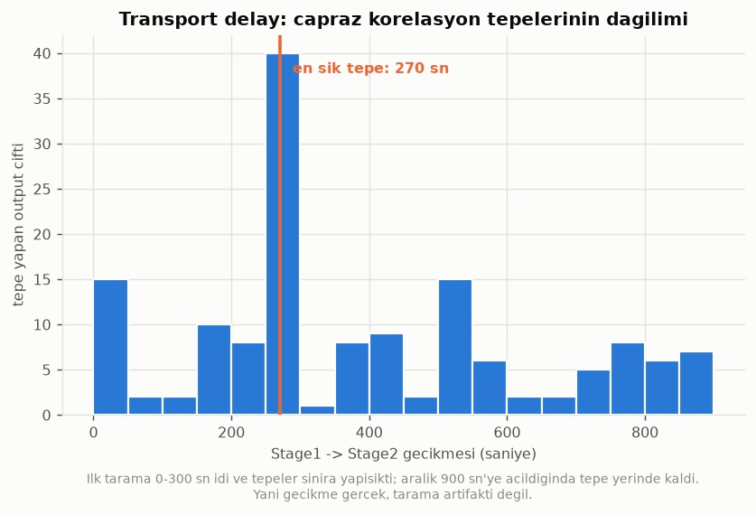

# Faz 2 - Stage 1 -> Stage 2 Baglantisi ve Transport Delay

Kaynak: `data/processed/clean_v1.csv`  
Uretildi: `python src/analysis/stage_link.py`

12 Stage1 x 13 Stage2 output = **156 cift**, 91 farkli gecikmede tarandi (0-300 sn).

## Neden bu analiz gerekli (A5)

Veri setinde transport delay belirtilmemis. Ayni satirdaki Stage 1 ve
Stage 2 olcumleri **ayni malzemeye ait olmayabilir**. Gecikme yanlis
varsayilirsa Stage1 -> Stage2 iliskileri sistematik olarak zayif cikar
ve Faz 3'te 'Stage 1 ciktisi Stage 2'yi etkilemiyor' gibi yanlis bir
sonuca varilir. Bu yuzden gecikme **sabit varsayilmadi, aranildi.**

## En iyi gecikmelerin dagilimi

Guvenilir cift (n_eff >= 30): **148 / 156**

| gecikme araligi (sn) | tepe yapan cift |
|---|---|
| 0-100 | 17 ########## |
| 100-200 | 12 ####### |
| 200-300 | 48 ############################## |
| 300-400 | 9 ##### |
| 400-500 | 11 ###### |
| 500-600 | 21 ############# |
| 600-700 | 4 ## |
| 700-800 | 13 ######## |
| 800-900 | 11 ###### |

> **BULGU L1 - Transport delay ~270 sn.** Ciftlerin yalnizca
> %7'i lag = 0'da tepe yapiyor; en sik tepe noktasi
> **270 sn**, medyan **270 sn**.
>
> **Bu tepe sinir artifakti degil.** Ilk tarama 0-300 sn araliginda
> yapildi ve tepeler 265 sn'de, yani ust sinira yapisik cikti -- bu
> durumda gercek tepenin disarida olma ihtimali vardi. Aralik 900
> sn'ye genisletildiginde tepe 270 sn'de kaldi ve sinira
> dayanan cift sayisi 13'de sinirli. Yani gecikme gercek.
>
> **Sonuc: A5 kismen cozuldu.** ~270 sn'lik bir gecikme var
> ve Faz 3'te Stage1 ciktilari Stage2 modeline bu kaydirma ile
> sokulacak. Yine de tek bir sabit sayiya kilitlenilmeyecek:
> gecikme output ciftine gore degisiyor (medyan 270 sn, dagilim genis), bu da tek bir malzeme akisi
> yerine birden fazla yol/karisim oldugunu dusundurur.

## En guclu Stage1 -> Stage2 iliskileri

| stage1 | stage2 | best_lag | r | r_at_lag0 | gain_over_lag0 | n_eff |
|---|---|---|---|---|---|---|
| Stage1.M8 | Stage2.M9 | 780 | 0.7511 | -0.0507 | 0.7004 | 1434.3 |
| Stage1.M2 | Stage2.M14 | 270 | 0.7341 | 0.1076 | 0.6265 | 75.8 |
| Stage1.M9 | Stage2.M12 | 380 | 0.6666 | 0.1903 | 0.4763 | 102.4 |
| Stage1.M2 | Stage2.M1 | 260 | 0.6499 | 0.0067 | 0.6432 | 77.7 |
| Stage1.M4 | Stage2.M5 | 270 | 0.6351 | 0.464 | 0.1711 | 30.7 |
| Stage1.M4 | Stage2.M14 | 270 | -0.6029 | -0.2786 | 0.3243 | 44.7 |
| Stage1.M4 | Stage2.M13 | 510 | 0.5898 | 0.4748 | 0.115 | 30.1 |
| Stage1.M3 | Stage2.M9 | 780 | 0.5675 | -0.0277 | 0.5398 | 1262.1 |
| Stage1.M1 | Stage2.M9 | 660 | 0.5576 | 0.3721 | 0.1855 | 32.3 |
| Stage1.M10 | Stage2.M3 | 60 | 0.5365 | 0.5262 | 0.0103 | 35.1 |
| Stage1.M6 | Stage2.M2 | 260 | -0.5041 | -0.2384 | 0.2657 | 114.6 |
| Stage1.M4 | Stage2.M1 | 270 | -0.5018 | -0.1796 | 0.3222 | 45.6 |
| Stage1.M4 | Stage2.M0 | 620 | 0.4759 | 0.4025 | 0.0734 | 78.1 |
| Stage1.M9 | Stage2.M2 | 230 | 0.4598 | 0.0098 | 0.45 | 145.3 |
| Stage1.M10 | Stage2.M5 | 310 | -0.4539 | -0.4149 | 0.039 | 52.2 |

> **BULGU L2 - En guclu bag: `Stage1.M8` -> `Stage2.M9`** (r = 0.7511, lag 780 sn, n_eff 1434.3).
> Stage 1 ciktisindaki sapma Stage 2'ye tasiniyor gorunuyor; bu,
> iyilestirmenin Stage 1'de yapilmasinin Stage 2'ye de fayda
> saglayabilecegi anlamina gelir. Faz 3'te model uzerinden test edilecek.

## Tam tablo (ilk 40, |r| azalan)

| stage1 | stage2 | best_lag | r | r_at_lag0 | gain_over_lag0 | n | n_eff | reliable | edge_peak |
|---|---|---|---|---|---|---|---|---|---|
| Stage1.M8 | Stage2.M9 | 780 | 0.7511 | -0.0507 | 0.7004 | 8965 | 1434.3 | True | False |
| Stage1.M2 | Stage2.M14 | 270 | 0.7341 | 0.1076 | 0.6265 | 13090 | 75.8 | True | False |
| Stage1.M12 | Stage2.M11 | 840 | 0.6907 | 0.415 | 0.2757 | 10030 | 22.3 | False | True |
| Stage1.M9 | Stage2.M12 | 380 | 0.6666 | 0.1903 | 0.4763 | 12925 | 102.4 | True | False |
| Stage1.M2 | Stage2.M1 | 260 | 0.6499 | 0.0067 | 0.6432 | 13302 | 77.7 | True | False |
| Stage1.M4 | Stage2.M5 | 270 | 0.6351 | 0.464 | 0.1711 | 13620 | 30.7 | True | False |
| Stage1.M4 | Stage2.M11 | 800 | -0.629 | -0.4602 | 0.1688 | 13091 | 25.1 | False | True |
| Stage1.M4 | Stage2.M3 | 270 | -0.6061 | -0.4968 | 0.1093 | 13073 | 27.7 | False | False |
| Stage1.M4 | Stage2.M14 | 270 | -0.6029 | -0.2786 | 0.3243 | 13001 | 44.7 | True | False |
| Stage1.M4 | Stage2.M13 | 510 | 0.5898 | 0.4748 | 0.115 | 13382 | 30.1 | True | False |
| Stage1.M3 | Stage2.M9 | 780 | 0.5675 | -0.0277 | 0.5398 | 9603 | 1262.1 | True | False |
| Stage1.M1 | Stage2.M9 | 660 | 0.5576 | 0.3721 | 0.1855 | 7819 | 32.3 | True | False |
| Stage1.M12 | Stage2.M13 | 0 | -0.5382 | -0.5382 | 0.0 | 10750 | 25.5 | False | False |
| Stage1.M10 | Stage2.M3 | 60 | 0.5365 | 0.5262 | 0.0103 | 13066 | 35.1 | True | False |
| Stage1.M12 | Stage2.M5 | 760 | -0.5105 | -0.4635 | 0.047 | 10110 | 23.8 | False | False |
| Stage1.M6 | Stage2.M2 | 260 | -0.5041 | -0.2384 | 0.2657 | 9008 | 114.6 | True | False |
| Stage1.M4 | Stage2.M1 | 270 | -0.5018 | -0.1796 | 0.3222 | 13214 | 45.6 | True | False |
| Stage1.M12 | Stage2.M3 | 900 | 0.4845 | 0.4193 | 0.0652 | 9905 | 19.3 | False | True |
| Stage1.M4 | Stage2.M0 | 620 | 0.4759 | 0.4025 | 0.0734 | 12678 | 78.1 | True | False |
| Stage1.M9 | Stage2.M2 | 230 | 0.4598 | 0.0098 | 0.45 | 12743 | 145.3 | True | False |
| Stage1.M10 | Stage2.M5 | 310 | -0.4539 | -0.4149 | 0.039 | 13483 | 52.2 | True | False |
| Stage1.M9 | Stage2.M10 | 430 | 0.4506 | 0.1276 | 0.323 | 12702 | 209.9 | True | False |
| Stage1.M6 | Stage2.M12 | 270 | -0.4494 | -0.2242 | 0.2252 | 9289 | 73.7 | True | False |
| Stage1.M9 | Stage2.M9 | 700 | 0.4421 | 0.1787 | 0.2634 | 9055 | 80.7 | True | False |
| Stage1.M10 | Stage2.M13 | 540 | -0.4343 | -0.4133 | 0.021 | 13259 | 52.2 | True | False |
| Stage1.M6 | Stage2.M5 | 410 | -0.4337 | -0.1826 | 0.2511 | 9327 | 54.1 | True | False |
| Stage1.M12 | Stage2.M10 | 890 | 0.4219 | 0.1071 | 0.3148 | 9974 | 38.9 | True | True |
| Stage1.M12 | Stage2.M14 | 590 | 0.42 | 0.3474 | 0.0726 | 9939 | 56.2 | True | False |
| Stage1.M6 | Stage2.M9 | 690 | -0.4182 | -0.163 | 0.2552 | 7334 | 57.7 | True | False |
| Stage1.M4 | Stage2.M2 | 270 | 0.4114 | 0.3683 | 0.0431 | 13303 | 73.0 | True | False |
| Stage1.M9 | Stage2.M11 | 410 | 0.3903 | 0.2488 | 0.1415 | 12707 | 105.5 | True | False |
| Stage1.M1 | Stage2.M12 | 200 | 0.3861 | 0.2489 | 0.1372 | 8128 | 37.9 | True | False |
| Stage1.M1 | Stage2.M14 | 410 | -0.3831 | -0.1088 | 0.2743 | 7819 | 36.4 | True | False |
| Stage1.M13 | Stage2.M3 | 0 | -0.3774 | -0.3774 | 0.0 | 13064 | 41.5 | True | False |
| Stage1.M12 | Stage2.M0 | 540 | -0.3772 | -0.3648 | 0.0124 | 9849 | 84.2 | True | False |
| Stage1.M1 | Stage2.M2 | 270 | 0.3755 | 0.2492 | 0.1263 | 7974 | 41.5 | True | False |
| Stage1.M14 | Stage2.M9 | 230 | 0.3754 | 0.2525 | 0.1229 | 7022 | 41.3 | True | False |
| Stage1.M6 | Stage2.M14 | 780 | 0.3748 | 0.0794 | 0.2954 | 9139 | 66.8 | True | False |
| Stage1.M10 | Stage2.M11 | 880 | 0.3741 | 0.3129 | 0.0612 | 12913 | 45.2 | True | True |
| Stage1.M4 | Stage2.M9 | 780 | 0.3729 | 0.1668 | 0.2061 | 9578 | 119.7 | True | False |
